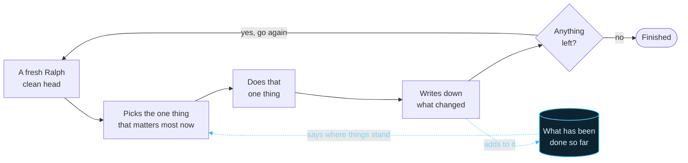

# Ralph

*Let Ralph ralph.*

A loop that runs itself. Be *on* the loop, not in it.

Point it at the work. Walk away. Check in.

---

## Be on the loop, not in it

**In the loop**, you are a step in the work. Nothing moves unless you move it.
Answer the question. Make the call. Start the next piece. It runs at your speed.
It stops when you look away. Your attention is the bottleneck. It fills up your
context window.

**On the loop**, it runs without you. You read what it is doing. You decide if it
is going the right way. You change what it was asked for. You step in because you
want to. The loop stays closed.

Ralph will not make you faster at the work. It gets you out of the middle of it.

---

## How Ralph works

Ralph never carries the whole job. It runs one short pass. It declares progress.
Then it starts clean. It keeps the plan of what is left.

No pass fills up the context window.

---

## What Ralph needs

Two things, read before every pass. What am I making? What am I doing next?

**The specs.** Your vision of the product. How it looks. How it behaves. What
counts as correct. This pins your vision down. A hundred passes add up to one
thing.

**The plan.** The same product, split up and ordered. Each piece fits in one
pass. It doubles as the scoreboard. Finished pieces get marked off.

---

## Where the specs and the plan come from

There are multiple ways. Here is one.

Change the prompt. Ralph stops building. It works through a product instead. One
page per pass. It writes down the specs and the plan. Same loop. Same short
passes. The looking is the work.

| | |
|---|---|
| **Read** | what the product says about itself |
| **Map** | every place you can get to |
| **Open** | one page per pass, properly |
| **Settle** | all of it into the specs and the plan |

**Only if you are copying.** That needs a product to exist. Building your own
idea? Skip it. Describe it to Claude. Argue about it. Change your mind. Let it
write the specs and the plan.

Ralph never asks where they came from.

---

*Start empty. Do one thing. Write it down. Go again.*

*Educational purposes only.*
