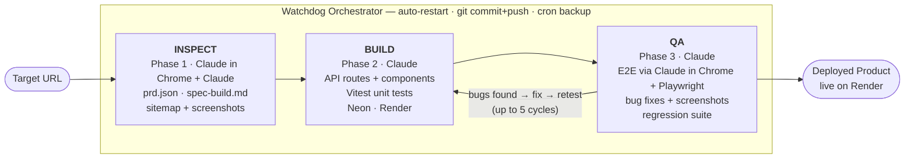

# Ralph-to-Ralph

**Autonomous Product Cloning Loop**

Give it any URL → It inspects, builds, tests, and deploys a working clone.



## What Is This?

Ralph-to-Ralph clones real products end-to-end — from browser analysis to deployed production software. Real, working products that you now own.

**The problem:** Non-technical founders know exactly what product they want to build or clone, but can't build and launch it at production quality themselves. Getting to production typically takes months or years, requires entire engineering teams, and costs significant money.

**The solution:** Ralph-to-Ralph automates the entire process. Point it at any SaaS product URL and it autonomously inspects, plans, builds, tests, and deploys a fully working clone.

## How It Works

Ralph-to-Ralph runs a three-phase autonomous pipeline:

### Phase 1: Inspect (Ralph Loop #1)

**Claude in Chrome + Claude Sonnet** analyzes the target URL and produces:
- `PRD.json` — structured product requirements
- `spec-build.md` — technical build specification
- Sitemap + screenshots of every page

### Phase 2: Build (Ralph Loop #2)

**Claude Agent (Sonnet)** builds the full stack:
- API routes + React components
- Unit tests (Vitest)
- Cloud infrastructure (Neon, Render)

### Phase 3: QA (Ralph Loop #3)

**Claude QA Agents** verify everything works:
- E2E testing via Claude in Chrome
- Bug fixes + visual regression screenshots
- Regression test suite

A **bug fix loop** (Bug Found → Fix → Retest, up to 5 cycles) runs between Build and QA until the product passes all checks.

## Watchdog Orchestrator

A strict watchdog wraps the entire pipeline, ensuring all Ralph loops stay stable and keep shipping:

- **Auto-restart on failure** — if any loop crashes, it restarts automatically
- **Git commit + push** — every milestone is committed and pushed
- **Cron backup** — periodic backups for safety

## AI Agents & Tools

| Agent | Role |
|-------|------|
| **Claude in Chrome** | Anthropic's browser extension — drives the signed-in Chrome window for site inspection and E2E testing |
| **Claude Sonnet** | Powers the Inspect and Build loops — architecture, code generation, infra setup |
| **Claude (QA)** | Runs independent fresh-context QA agents for thorough verification |

## Running It

```bash
# 1. Check the environment once (Neon, dashboard key)
./scripts/preflight.sh

# 2. Point the pipeline at a target product
./ralph/ralph-to-ralph.sh https://example.com
```

The watchdog takes it from there — inspect, build, QA — committing after
every feature. Progress is visible in `prd.json` (`passes` flags),
`ralph/.state/runs/<run-id>/progress.txt` (one file for the whole run —
every phase and every session appends to it, alongside each session's
cost/context/subagent ledger), and `report-qa.json`.

### What a Completed Run Produces

- **A real backend** — the clone serves its own REST API; it never proxies the target's
- **Real cloud infrastructure** — Neon Postgres via Drizzle, uploads stored in Postgres, deployed on Render
- **A dashboard** — pages matching the target product's UI, built from inspection screenshots
- **A TypeScript SDK** in `packages/sdk/` when the target ships a client library
- **API docs** — an auto-generated `/docs` page covering every endpoint
- **A test suite** — Vitest unit tests plus Playwright E2E specs, one of each per feature
- **An auth wall** — API keys unlock both the dashboard and the API

## Tech Stack

- **Framework:** Next.js 16 (App Router, Turbopack)
- **Language:** TypeScript (strict mode)
- **Styling:** Tailwind CSS
- **UI:** Radix UI
- **Database:** Neon serverless Postgres via Drizzle ORM
- **Storage:** Neon Postgres (`bytea` columns)
- **Deployment:** Render (built from the GitHub repo, native Node runtime)

## Demo 2026

Built as a demonstration of autonomous product cloning with AI agents.
